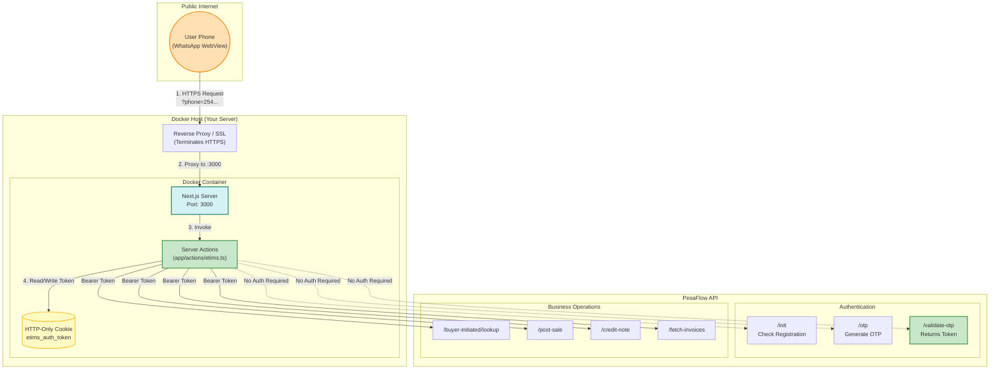
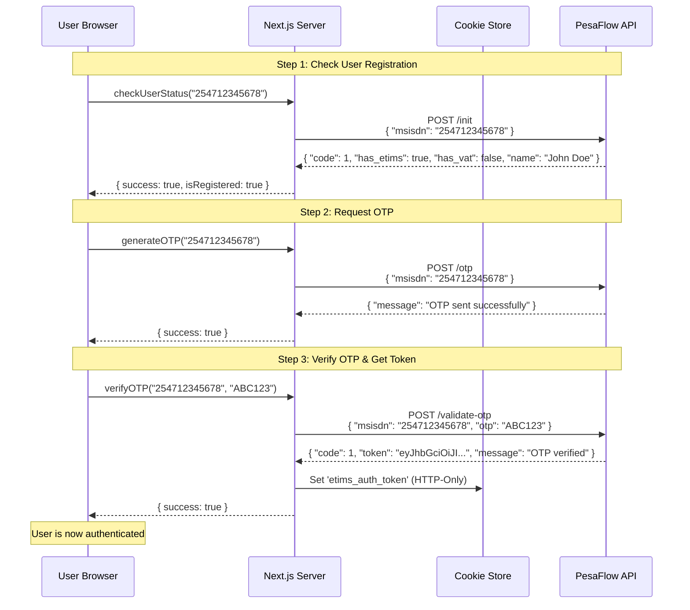
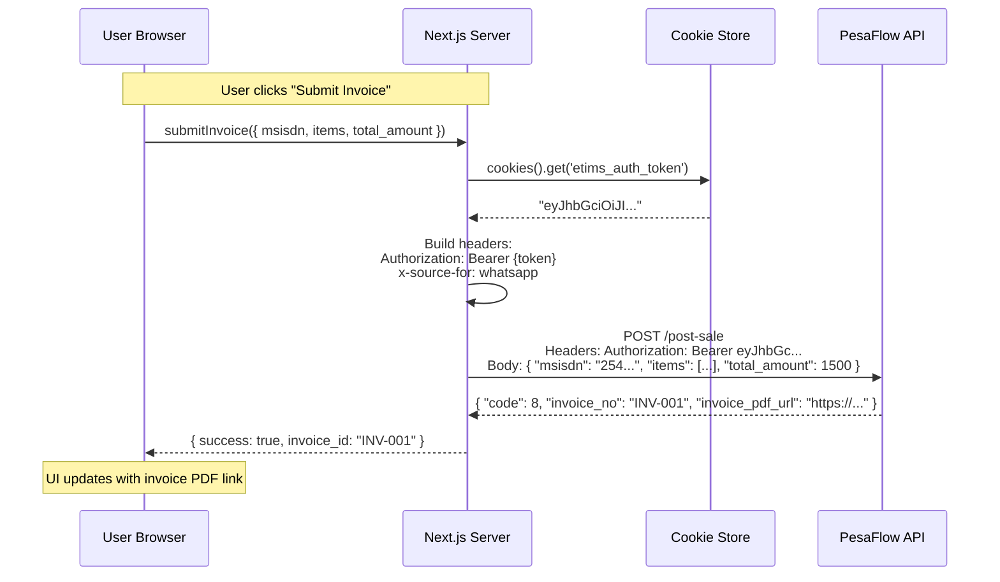
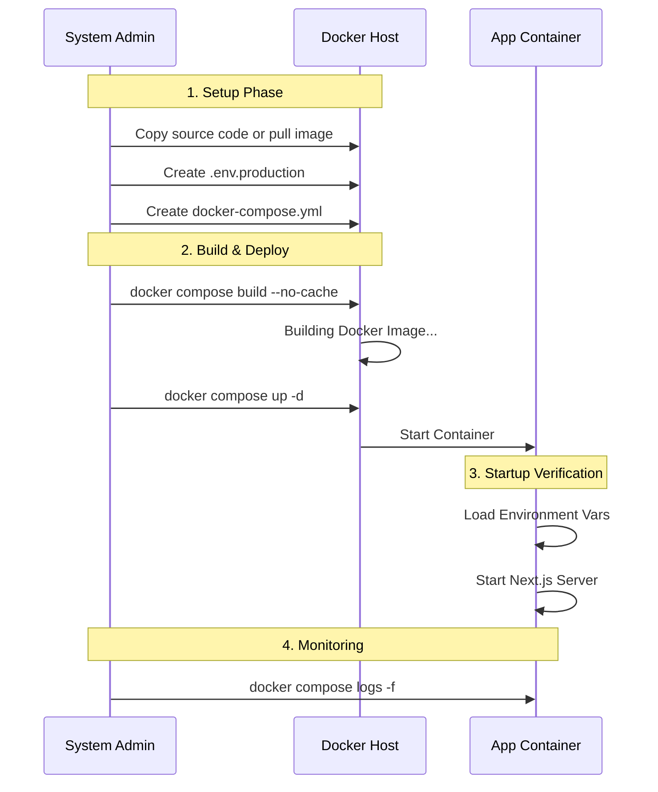

# Docker Deployment Guide (Standalone)

This guide details how to deploy the **WhatsApp eTIMS** application using Docker and Docker Compose. It consolidates architectural insights, security requirements, and operational steps from our technical documentation.

---

## 1. Project Overview

| Item | Details |
|:-----|:--------|
| **Application Name** | WhatsApp eTIMS |
| **Technology Stack** | Next.js 16, React 19, TypeScript, TailwindCSS 4 |
| **Delivery Channel** | WhatsApp WebView |
| **Target Users** | Non-VAT Registered Taxpayers |
| **Backend API** | `https://kratest.pesaflow.com/api/ussd` |
| **Container Format** | Docker Image (Linux/Node.js) |

### Core Features
- **eTIMS Sales Invoicing** - Create and send tax invoices via WhatsApp
- **Credit Notes** - Full and partial credit note processing
- **Buyer-Initiated Invoices** - Buyer creates, Seller approves workflow

---

## 2. System Architecture

The application operates as a **Secure Gateway** (BFF Pattern) between WhatsApp users and the PesaFlow APIs. It is designed to be stateless and containerized.

### High-Level Data Flow



### Authentication Flow (OTP → Token)

This diagram shows the login process: check status → send OTP → verify OTP → get token.



### Business Operation Flow (with Token)

This diagram shows an authenticated API call to submit an invoice.



---

## 3. API Endpoints Integrated

All API calls route through the upstream API.

> [!IMPORTANT]
> **Test Environment:** `https://kratest.pesaflow.com/api/ussd`
> **Production Environment:** `https://ecitizen.kra.go.ke/api/ussd`
>
> Ensure the correct URL is set in `NEXT_PUBLIC_API_BASE_URL` for your deployment.

| Endpoint | Description |
|:---------|:------------|
| `lookup` | Customer/PIN verification |
| `submit_invoice` | Create sales invoice |
| `credit_note` | Submit credit notes |
| `fetch_invoices` | Retrieve buyer-initiated invoices |
| `process_buyer_invoice` | Accept/reject buyer invoices |
| `check_user_status` | Verify eTIMS registration |
| `register_taxpayer` | Register for eTIMS service |
| `generate_otp` / `verify_otp` | Authentication |

### Request Headers
All requests from Server Actions include:
```
Authorization: Bearer <etims_auth_token>
x-source-for: whatsapp
Content-Type: application/json
```

---

## 4. WhatsApp Integration

### Notification Types

| Type | Trigger | Purpose |
|:-----|:--------|:--------|
| `etims_invoice` | Sales invoice created | Send Invoice PDF to seller/buyer |
| `etims_credit_note` | Credit note submitted | Send Credit Note PDF |
| `etims_buyer_pending` | Buyer invoice created | Notify buyer for approval |
| `etims_buyer_action` | Buyer accepts/rejects | Notify seller of decision |

### WhatsApp API Configuration
- Uses Meta WhatsApp Business Cloud API
- Sends PDFs as document attachments
- Sends text notifications for status updates

---

## 5. Application Routes

| Route | Description |
|:------|:------------|
| `/` | Main services dashboard |
| `/etims` | eTIMS invoicing module |
| `/etims/auth/*` | Authentication (login, OTP) |
| `/etims/sales-invoice/*` | Sales invoice wizard |
| `/etims/credit-note/*` | Credit note flow |
| `/etims/buyer-initiated/*` | Buyer/Seller invoice flow |

---

## 6. Security Considerations

| Feature | Implementation |
|:--------|:---------------|
| **HTTP-Only Cookies** | Auth tokens stored in `etims_auth_token` cookie, inaccessible to JavaScript. |
| **Server-Side Secrets** | API keys and base URLs are only available on the server (`process.env`). |
| **VAT Restriction** | Hard block prevents VAT-registered taxpayers from using the service. |
| **Token Injection** | All API requests are authenticated server-side in `app/actions/`. |
| **Context Injection** | Phone number passed via URL query parameter (`?phone=254...`). |

---

## 7. Deployment Artifacts & Prerequisites

### Required Software
*   **Docker Engine**: (v20.10+)
*   **Docker Compose**: (v2.0+)

### Environment Variables
Create a `.env.production` file with these values. An example template is provided in the project:

**Template:** `env.example`

| Variable | Description | Example Value |
| :--- | :--- | :--- |
| `HOST_PORT` | The external port to expose the application on. | `3000` |
| `WHATSAPP_PHONE_NUMBER_ID` | Meta Business ID for the phone number. | `5896221609...` |
| `WHATSAPP_ACCESS_TOKEN` | System User Token with messaging permissions. | `EAA...` |
| `NEXT_PUBLIC_WHATSAPP_NUMBER` | The display number (no `+` sign). | `254708427694` |
| `NEXT_PUBLIC_API_BASE_URL` | Base URL for the upstream API. | `https://ecitizen.kra.go.ke/api/ussd` |
| `NEXT_PUBLIC_APP_URL` | The URL of the application. | `https://ecitizen-test.kra.go.ke` |

```bash
# Copy the template to create your production config
cp env.example .env.production
```

> [!NOTE]
> For testing, use `https://kratest.pesaflow.com/api/ussd` as the `NEXT_PUBLIC_API_BASE_URL`.
> For production, use `https://ecitizen.kra.go.ke/api/ussd`.

### Network Requirements

| Category | Requirement |
|:---------|:------------|
| **Subdomain** | A-Record for `whatsapp.kra.go.ke` (or your domain) pointing to your server. |
| **Firewall (Outbound)** | Allow HTTPS (Port 443) to `kratest.pesaflow.com`. |
| **Firewall (Inbound)** | Allow HTTPS (Port 443) from public internet to Nginx/Load Balancer. |
| **TLS Certificate** | Valid SSL certificate for your domain (e.g., via Let's Encrypt). |

---

## 8. Docker Compose Setup

A `docker-compose.yml` file is provided in the project.

> The port mapping uses `${HOST_PORT:-3000}:3000`. This means: use the value of `HOST_PORT` from `.env.production`, or default to `3000` if not set. Change `HOST_PORT` in your `.env.production` file to use a different port (e.g., `8080`).

---

## 9. Operational Workflow



---

## 10. Step-by-Step Deployment Instructions

### **Method 1: Using Pre-built Image**


#### Step 1: Prepare the Environment
```bash
mkdir etims
cd etims
```

#### Step 2: Configure Secrets
```bash
nano .env.production
# Paste the variables listed in Section 7
```

#### Step 3: Pull and Run the Image
```bash
# Pull the latest image
docker pull ghcr.io/chatnationwork/etims-app:latest

# Run the container with environment variables
docker run -d \
  -p 3000:3000 \
  --name etims-app \
  --env-file .env.production \
  ghcr.io/chatnationwork/etims-app:latest
```

#### Step 4: Verify Deployment
```bash
# Check if container is running
docker ps

# View application logs
docker logs etims-app

# Test the application
curl http://localhost:3000/etims
```

#### Step 5: Stop/Restart
```bash
# Stop the application
docker stop etims-app

# Start the application
docker start etims-app

# Remove the container
docker rm etims-app
```

### **Method 2: Build from Source**

#### Step 1: Prepare the Environment
```bash
git clone https://github.com/chatnationwork/etims.git
cd etims
```

#### Step 2: Configure Secrets
```bash
nano .env.production
# Paste the variables listed in Section 7 above.
```

#### Step 3: Build and Run
```bash
docker compose build
docker compose up -d
```

---


## 11. File Structure

```
etims/
├── app/
│   ├── _components/      # Shared UI components
│   ├── actions/          # Server actions (API proxy)
│   │   └── etims.ts      # Main API proxy logic
│   └── etims/            # eTIMS invoicing module
├── docs/                 # Documentation
├── scripts/              # Test scripts
├── Dockerfile            # Container build instructions
├── env.example           # Environment template
└── package.json          # Dependencies
```

---

