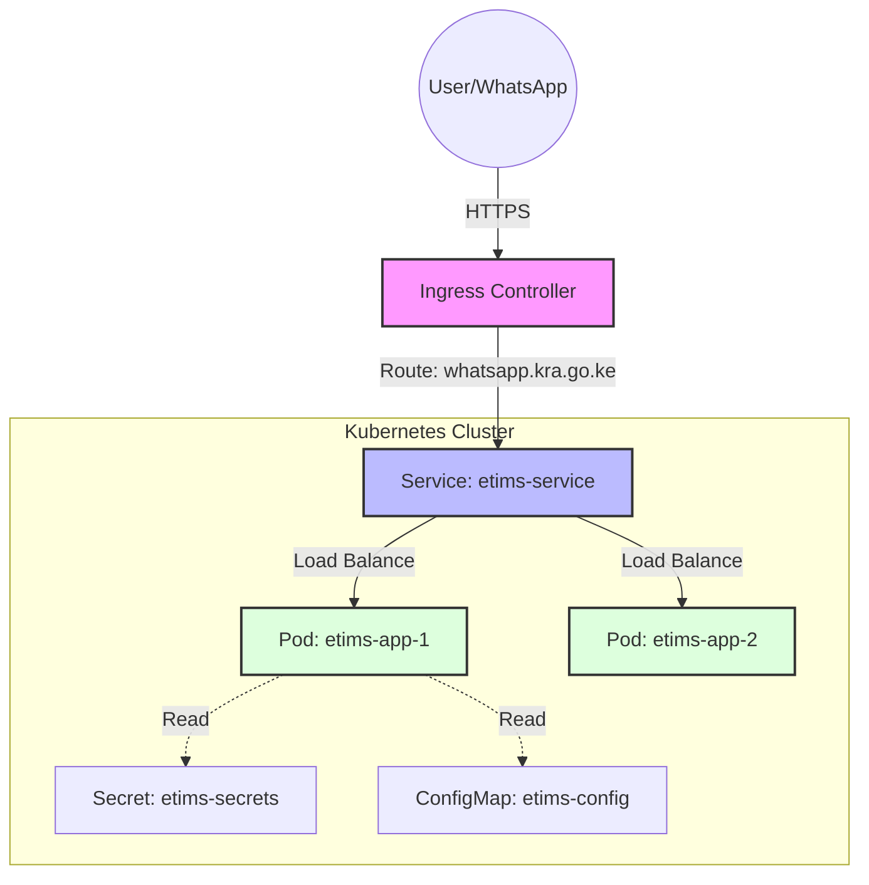
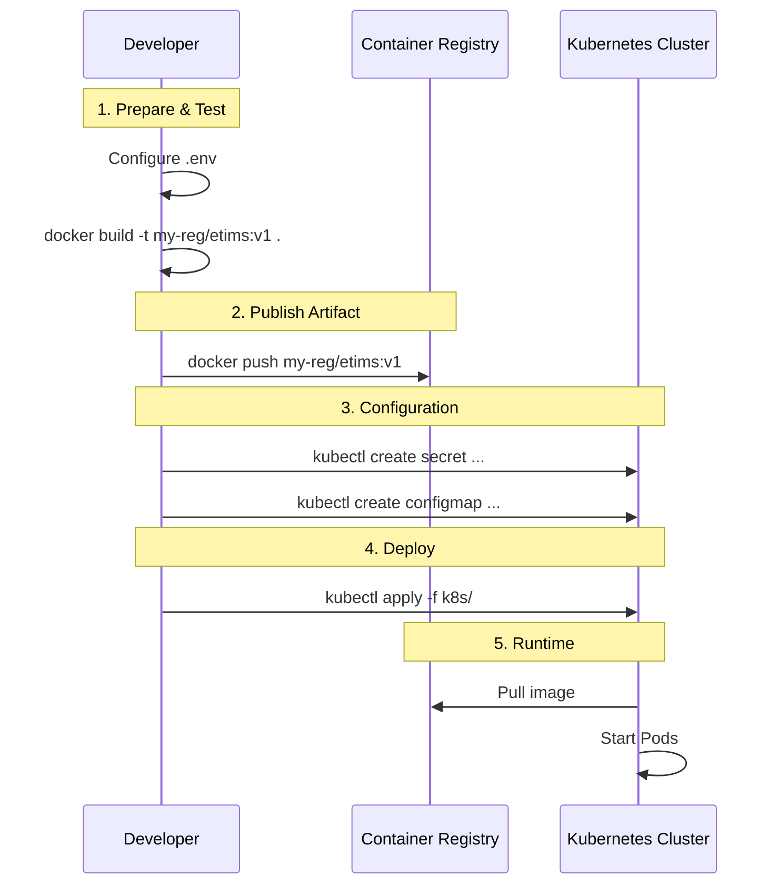

# Master Deployment Guide

This guide provides a comprehensive, step-by-step walkthrough for deploying the etims application. It covers prerequisites, architecture, local testing, and production deployment on Kubernetes.

## 1. Architecture Overview

High-level architecture of the deployed application in Kubernetes.



## 2. Deployment Workflow

The process from code to running application.



## 3. Prerequisites

Before you begin, ensure you have:

1.  **Docker Installed**: For building images.
2.  **Kubectl Installed**: For interacting with the cluster.
3.  **Kubernetes Cluster Access**: `kubeconfig` file configured.
4.  **Container Registry**: Access to push images (e.g., Docker Hub, GCR, ECR).
5.  **Environment Variables**:
    *   `WHATSAPP_PHONE_NUMBER_ID`
    *   `WHATSAPP_ACCESS_TOKEN`
    *   `NEXT_PUBLIC_WHATSAPP_NUMBER`

## 4. Step-by-Step Deployment

### Step 1: Secure Configuration (Secrets)

Create the necessary secrets and config maps in your cluster.

**Secrets (Sensitive Data):**
```bash
# Create namespace
kubectl create namespace chatnation

# Create secrets
kubectl create secret generic etims-secrets \
  --namespace=chatnation \
  --from-literal=WHATSAPP_PHONE_NUMBER_ID="<YOUR_PHONE_ID>" \
  --from-literal=WHATSAPP_ACCESS_TOKEN="<YOUR_ACCESS_TOKEN>"
```

**ConfigMap (Non-Sensitive):**
```bash
kubectl create configmap etims-config \
  --namespace=chatnation \
  --from-literal=NEXT_PUBLIC_WHATSAPP_NUMBER="<DISPLAY_NUMBER>" \
  --from-literal=NEXT_PUBLIC_API_BASE_URL="<API_URL>"
```

### Step 2: Build and Push Docker Image

Build the image locally and push it to your remote registry.

```bash
# Set your registry url
export REGISTRY="<YOUR_REGISTRY_URL>" # e.g., docker.io/myname or gcr.io/myproject
export TAG="v1.0.0"

# Build
docker build -t $REGISTRY/etims-app:$TAG .

# Login (if needed)
docker login

# Push
docker push $REGISTRY/etims-app:$TAG
```

### Step 3: Update Manifests

Update `k8s/deployment.yaml` to use your new image tag.

**Option A: Manual Edit**
Open `k8s/deployment.yaml` and change line 20:
```yaml
image: <YOUR_REGISTRY_URL>/etims-app:v1.0.0
```

**Option B: CLI Command**
```bash
# If on Linux/Mac
sed -i "s|image: .*|image: $REGISTRY/etims-app:$TAG|g" k8s/deployment.yaml
```

### Step 4: Apply to Kubernetes

Deploy the resources to your cluster.

```bash
kubectl apply -f k8s/deployment.yaml
kubectl apply -f k8s/service.yaml
kubectl apply -f k8s/ingress.yaml
```

### Step 5: Verification

Check if everything is running correctly.

```bash
# View all resources
kubectl get all -n chatnation

# Check logs of the app
kubectl logs -l app=etims-app -n chatnation
```

## 5. Troubleshooting Guide

| Issue | Check | Solution |
|-------|-------|----------|
| **ImagePullBackOff** | `kubectl describe pod ...` | Check if Registry URL is correct and if K8s has pull secrets. |
| **CrashLoopBackOff** | `kubectl logs ...` | Check application logs. Often missing env vars. |
| **Ingress 404** | `kubectl get ingress` | Check if Host rule matches your URL exactly. |
| **Pending Pods** | `kubectl get nodes` | Check if cluster has enough resources (CPU/Memory). |

### Common Commands for Debugging

```bash
# Stream logs
kubectl logs -f -l app=etims-app -n chatnation

# Enter the container shell
kubectl exec -it deployment/etims-app -n chatnation -- sh

# Restart deployment
kubectl rollout restart deployment/etims-app -n chatnation
```
