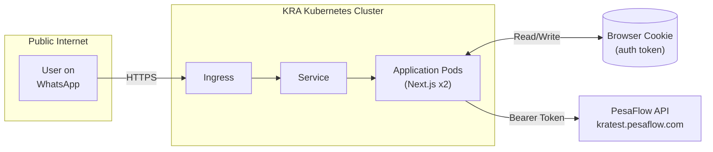

# Architecture Review Response

**To:** Architecture Review Team
**Date:** January 14, 2026
**Subject:** Response to Architecture Review Findings

We have reviewed your request for additional information. Please find our responses below corresponding to the points raised.

---

## 1. PesaFlow Identity Service & API Hosting

**Question:** Are the PesaFlow Identity Service and APIs hosted internally/Public? Please share URLs/IPs.

**Response:**
The PesaFlow Identity Service and APIs are currently **Publicly Accessible** via the internet. The application connects to them via standard HTTPS DNS resolution.

- **API Base URL:** `https://kratest.pesaflow.com/api/ussd`
- **Hosting Status:** Public Internet Facing
- **Access Method:** HTTPS (Port 443)

### Updated Architecture Diagram

### How It Works:
1. **User** opens link in WhatsApp WebView
2. **Request** goes to Ingress → Service → Pod
3. **Pod** (Next.js Server Action) reads auth token from the **HTTP-only cookie**
4. **Pod** calls **PesaFlow API** with `Authorization: Bearer <token>`
5. **Response** flows back to user

> The cookie is stored in the user's browser but is **only accessible by the server** (HTTP-only flag). JavaScript cannot read it.

## 2. Application Containerization & Delivery

**Question:** Confirm if the application will be delivered as a Docker container and provide Kubernetes manifests.

**Response:**
**Yes**, the Next.js application can be delivered as a **Docker Container**.

- **Delivery Format:** Docker Image (Linux/Node.js)
- **Container Registry:** (To be determined / Provided by KRA Registry)
- **Kubernetes Manifests:** We have attached the standard Kubernetes manifests required for deployment:
    - `deployment.yaml` (Application workload)
    - `service.yaml` (Internal networking)
    - `ingress.yaml` (External access configuration)

## 3. KRA Identity Service Clarification

**Question:** Clarify what the KRA Identity Service is and which tokens it will be issuing.

**Response:**
The "KRA Identity Service" refers to the authentication mechanism exposed by the PesaFlow API.

- **Service Role:** It validates user credentials (PIN/ID) and issues a session token.
- **Token Type:** `Bearer` Token (JWT or Opaque string).
- **Flow:**
    1. The application sends a validation request (e.g., PIN/ID lookup).
    2. Upon success, the API responds with an authentication token.
    3. This token is stored by our application in an **HTTP-Only Secure Cookie** (`etims_auth_token`).
    4. All subsequent requests to the PesaFlow API include this token in the `Authorization: Bearer <token>` header.

This ensures that the sensitive token is never exposed to the client-side browser/WebView code.
